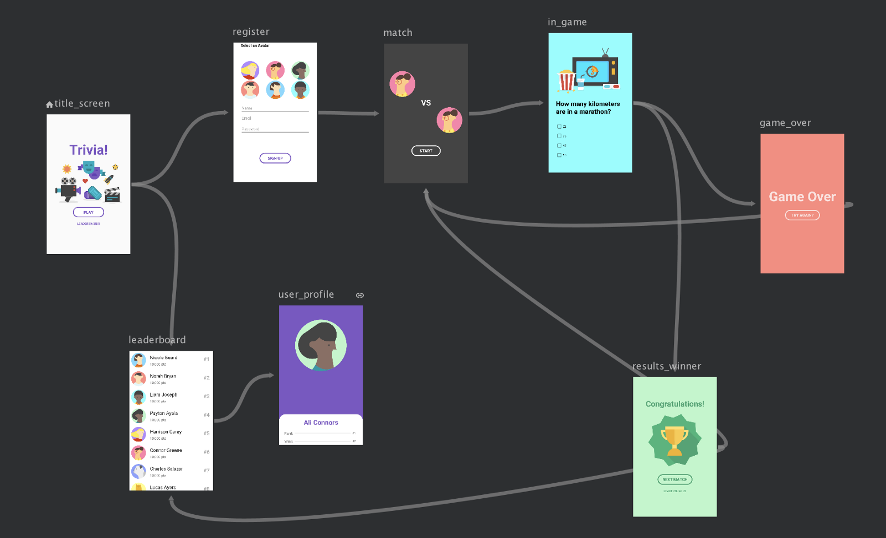
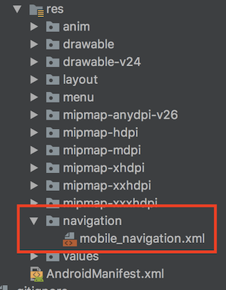
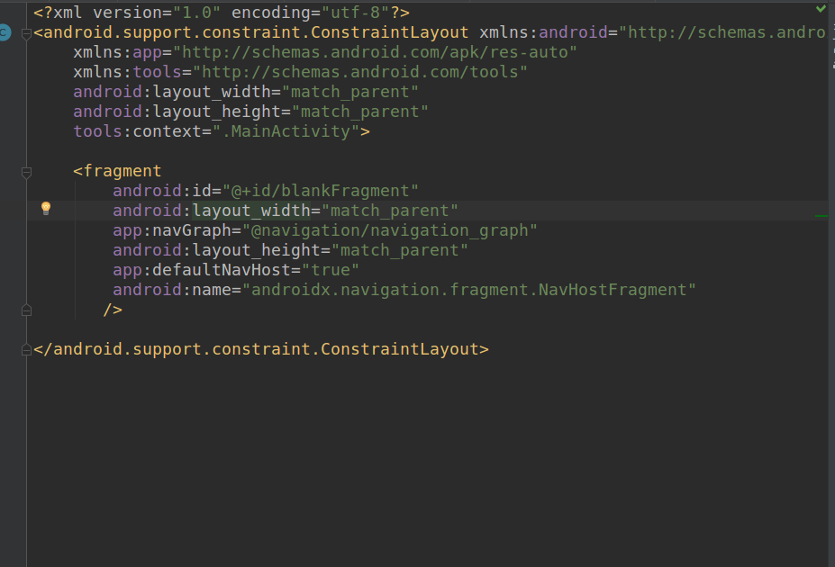
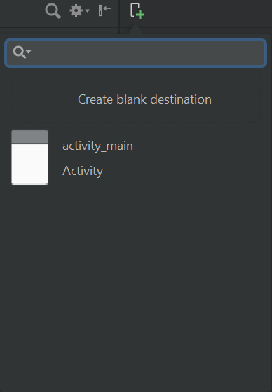

# navigationcomponent

The Android Navigation Components library is part of the Android JetPack set of libraries announced and released during Google I/O 2018.

There are some steps to achieve this NavigationComponent in Android 

## Step 1
Update your Android Studio in 3.3 and above

## Step 2
 Implement gradle files

     def nav_version = "1.0.0-alpha11"
     implementation "android.arch.navigation:navigation-fragment:$nav_version" // use -ktx for Kotlin
     implementation "android.arch.navigation:navigation-ui:$nav_version"

## Step 3
  Create navigation graph under navigation resource type

 

## Step 4
Put a fragment inside your MainActivity and add these lines in your fragment for set home

        > app:defaultNavHost="true"
        > app:navGraph="@navigation/navigation_graph"
        > android:name="androidx.navigation.fragment.NavHostFragment"

 

## Step 5

You can add destination and move your cursor from one fragment to another fragment to attach

### Note
The Navigation components are designed for apps that have one main activity with multiple Fragment destinations. The main activity hosts the navigation graph and is responsible for swapping destinations as needed. In an app with multiple activity destinations, each additional activity hosts its own navigation graph. For more information, see Modifying an activity to host navigation.

    
    
    
    
    
    
    
